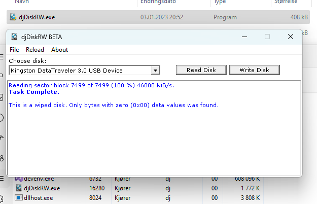

## djDiskRW

Et lite program jeg skrev for å lese og skrive overflaten til en harddisk, mest for morro skyld.  

 
- Det står BETA, men publisert versjon er 1.0  

**Flere formål**  
Når man kjøper en ny eller brukt harddisk kan det være uoppdagede dårlige sektorer eller blokker 
(utover det som er reservert som akseptabelt fra OEM som skjules fra SMART) som SMART kun vil 
rapportere etter at man faktisk har prøvd å benytte disse områdene. Dette programmet lar meg 
enkelt lese hver eneste sektor på en disk og så sjekke SMART for å se om noe har blitt oppdaget. 
Før jeg evt. kaster eller selger den igjen, kan det også være jeg vil slette den på en sikker måte(*) 
ved å skrive alle sektorer til 0. Noe diskpart med clean all enkelt kan gjøre i windows, men ikke med 
verifisering, eller faktisk noe som helst informasjon i det hele tatt. Dette programmet leser 
tilbake hver eneste sektor som overskrives for å verifisere at alt ble grundig nullet ut.  

Programmet holder systemet våkent under lesing og/eller skriving.  
  
  
***) ZERO-PASS og trygghet**  
Noen folk bryr seg mer om semantikk og pedanteri enn hva som fungerer for sitt formål. 
De kan f.eks. ha bekymringer om snudde bits på SSD lagring. Noen få bits kommer aldri 
til å være nok til å gjenopprette noe som helst meningsfull data. Dette krever flere bytes (1 byte er 8 bits).  

ZERO-PASS er en runde hvor man skriver 0-bytes over hele diskens område. 
Disker som har mye skrivefeil eller firmware problemer bør heller fysisk destrueres.  

En disk (til og med SSD) som blir komplett overskrevet, vil kun vise HEX0 over hele overflaten og ikke være gjenopprettelig.  

Både HDD og SSD disker vil ha svært fragmenterte bits på overflaten og via wear leveling og TRIM algoritmer er 
dette enda verre på SSD. En byte er 8 bits, og for å få noe meningsfull data trenger man hundrevis, 
om ikke tusenvis av bytes med integritet. Den integriteten går tapt i sin helhet ved komplett utnulling av diskers lagerområder.  

Firmaet IBAS ONTRACK AS, som NSM og datatilsyn, anser som autoriteten på sletting og gjenoppretting av data, 
har bekreftet at dersom en SSD har fått filer omgjort til HEX0 i stedet for f.eks. bare RAW eller bare blitt 
offer for slettet filsystem og/eller volum, er det ikke lenger mulig for dem å få filene opp å gå igjen.  

Det er kanskje åpenbart, men jeg vil uttrykkelig be brukere om å være forsiktig med bruken av programmet. 
For morro skyld har jeg prøvd å bruke det på systemdisken for å evaluere potensiell skade. 
Systemet vil stoppe skrivingen, men ikke før man har skrevet over kritiske startsektorer som definererer systempartisjoner. 
Jeg korrigerte dette på under 10 minutter ved å gj.opprette partisjonen med AOMEI partition assistant, 
GPT konvertering og en runde BCDBOOT. Men det anbefales ikke... Funksjonalitet er grundig testet, 
men programmet kommer uten garantier og bruk er på eget ansvar.  
  
  
**Tekniske notater på engelsk fra tidligere artikkel fra nettside**  
Uses ~3 MB ram. File is a ~0.5 MB sized portable x64 Win32 program, no install or footprint.  

**Read Disk**  
* Reads entire surface, 1MiB at a time. Will detect any non-zero sector bytes. This serves to both verify a wipe, and trigger any rarely used sectors in SMART. 

**Write Disk**  
* Writes entire surface, 1MiB at a time. Will verify and detect any non-zero written byte. 
This serves to both securely(*) wipe a disk, and trigger any rarely used bad sectors in SMART.  

* If a written byte could not be verified as being zero, it will continue to write, 
but you should definitely check its SMART status and consider physically destroying it if discarding.  

* When detecting drives, a red colored note will indicate the index 0 disk, as usually system disk. 
Indexes and letters are not reliable 100% indicators, even less when used from live boot images. 
So don't trust the index. The responsibility of choosing a correct target disk, falls on the user.  

**I've tested writing to a live booted system disk on a test computer from within Windows 11:**  
Start sectors got written before I got access denied, and effectively ruined the partition table. 
This was very easily fixable via AOMEI Partition Assistant I have on my USB iso tool stick. 
I converted back to GPT and rebuilt the boot partition with bcdboot. All fixed in under 5 minutes. 
It was very limited how much damage I was allowed to do on a live online system. 